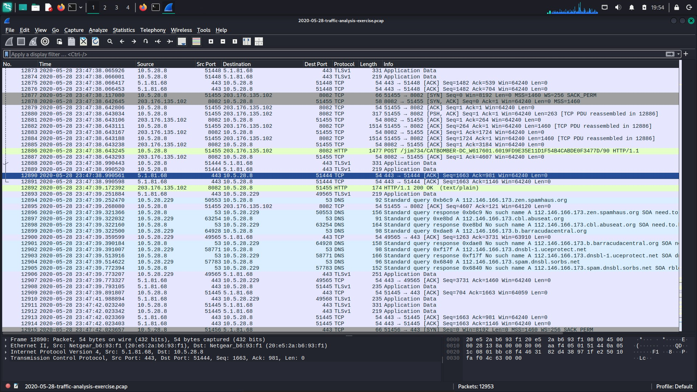
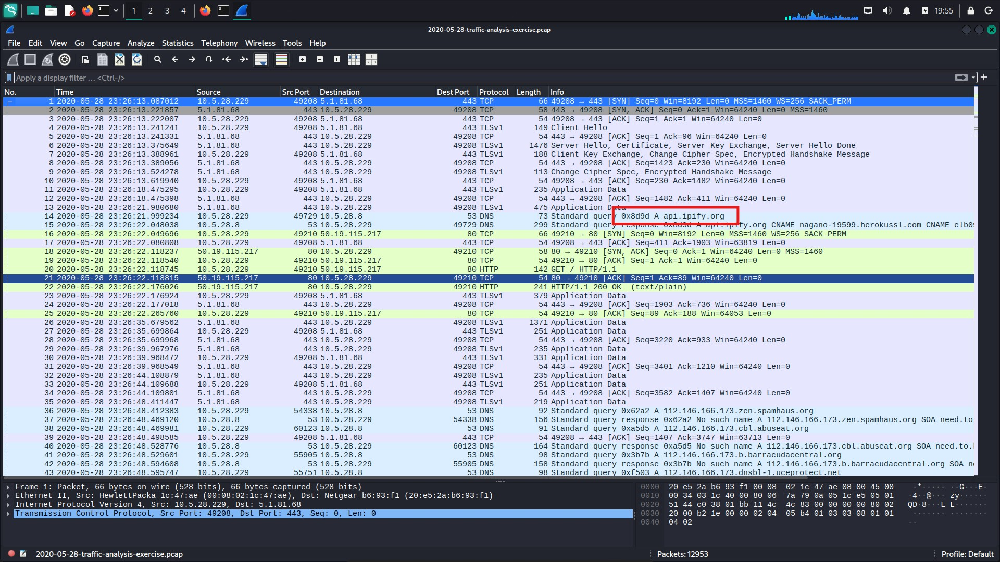
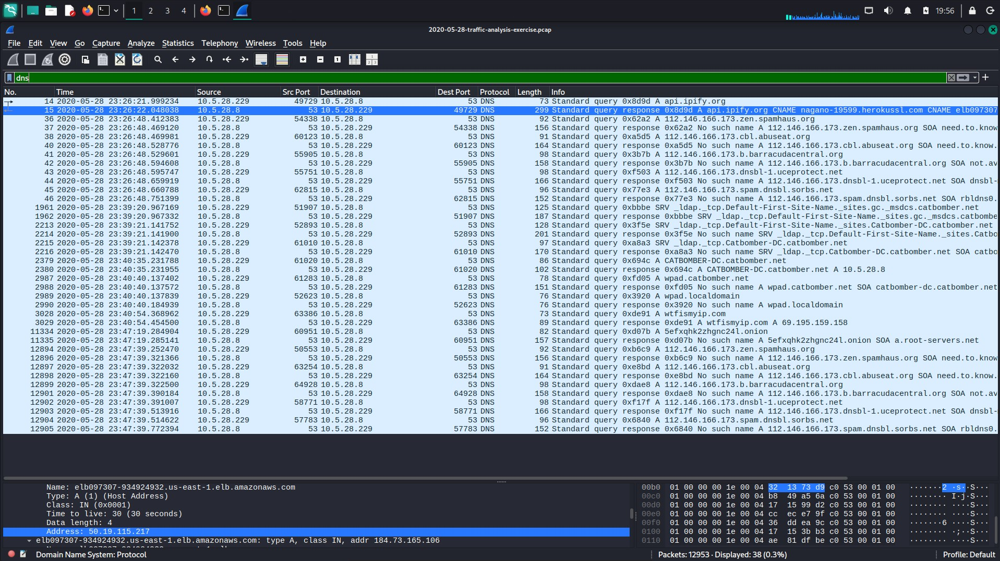
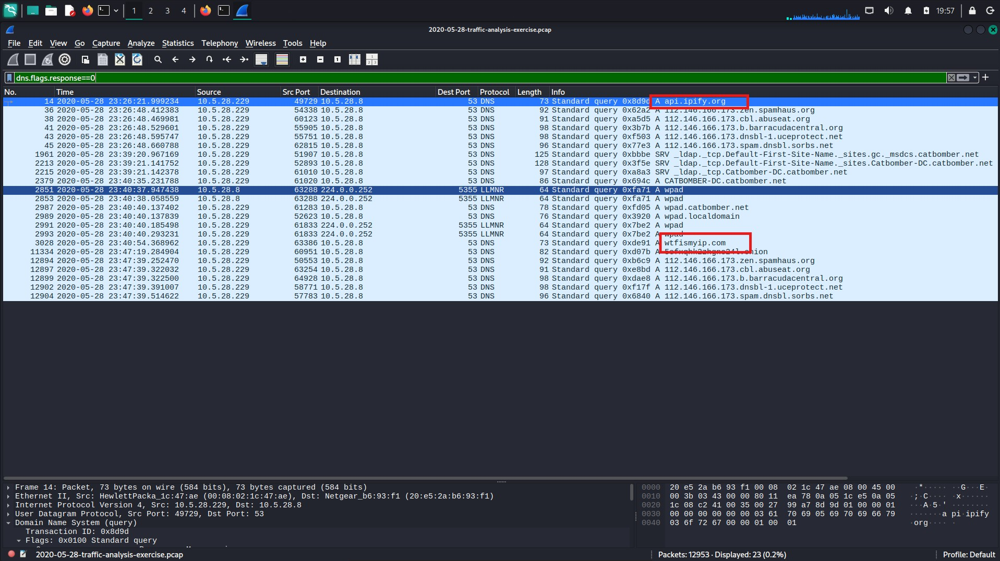
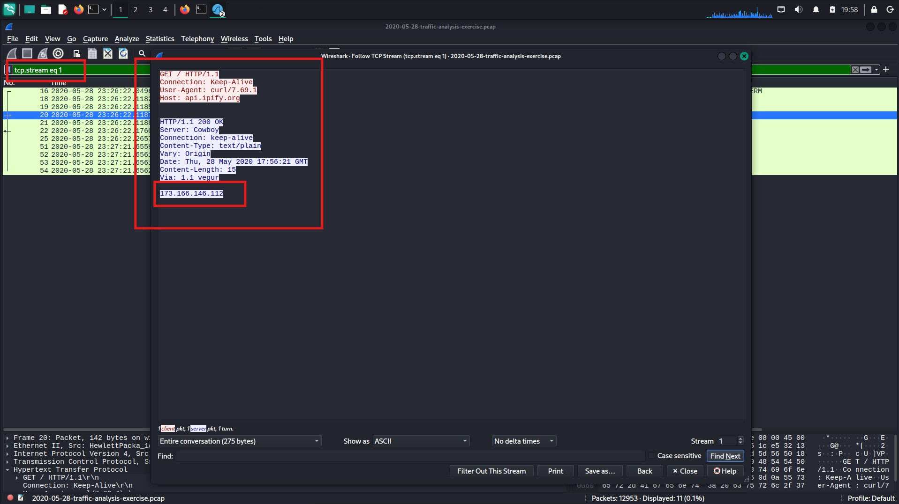
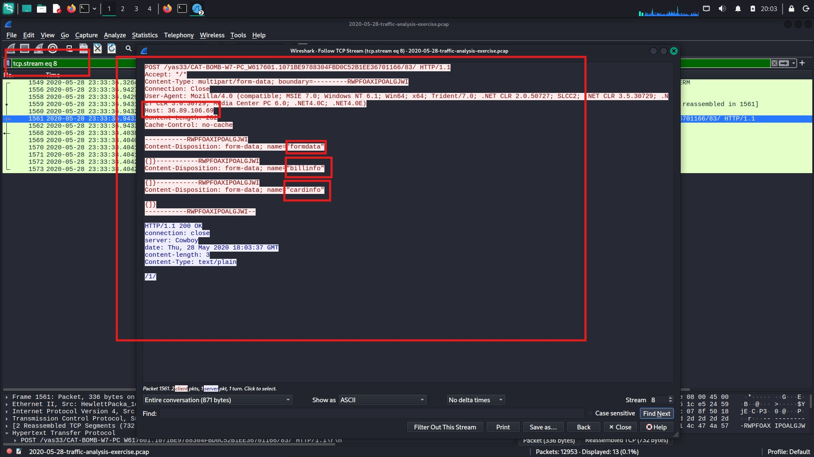
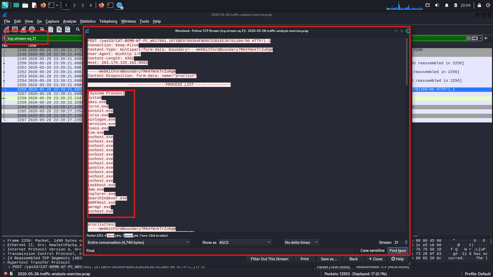
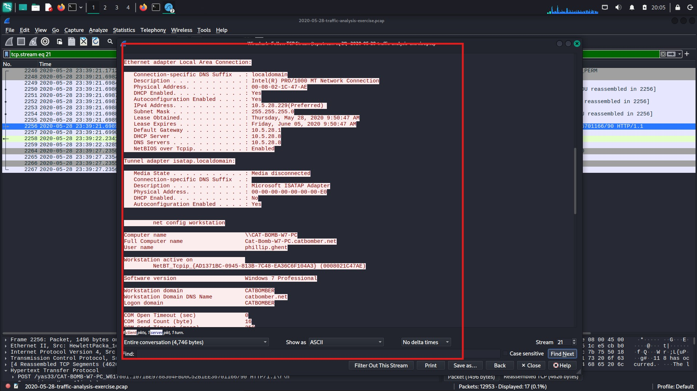
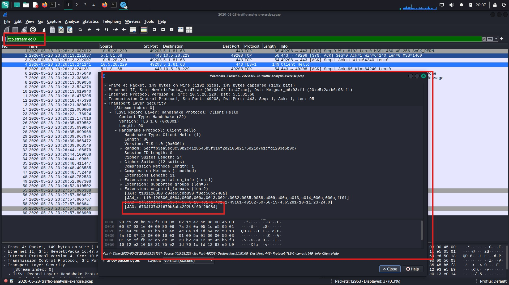
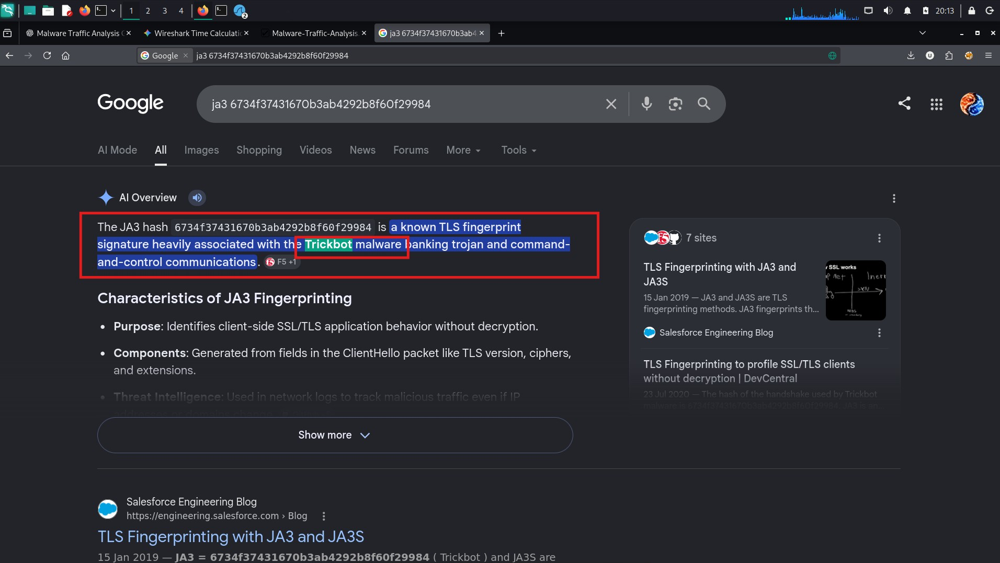

# Malware Traffic Analysis Report

**Title:** Malware Network Traffic Analysis using Wireshark  
**Analyst:** Kuldeep Gade  
**Date:** 25 July 2026  
**Tool Used:** Wireshark  
**Capture File:** `2020-05-28-traffic-analysis-exercise.pcap`

---

# Objective

The objective of this analysis is to investigate a suspicious PCAP file, identify indicators of compromise (IOCs), analyze DNS and HTTP communications, inspect POST requests, determine what information is being transmitted by the infected host, and understand the malware's network behavior.

---

# Folder Structure

```
Malware_Analysis_01/
│
├── screenshots/
│   ├── 1.jpg
│   ├── 2.jpg
│   ├── 3.jpg
│   ├── 4.jpg
│   ├── 5.jpg
│   ├── 6.jpg
│   ├── 7.jpg
│   ├── 8.jpg
│   ├── 9.jpg
│   └── 10.jpg
│
├── 2020-05-28-traffic-analysis-exercise.pcap
└── report.md
```

---

# Environment

- Operating System: Kali Linux
- Tool: Wireshark
- File analyzed:
  `2020-05-28-traffic-analysis-exercise.pcap`

---

# Step 1 – Open the PCAP File

The PCAP file was opened using Wireshark.

The first interesting observation appeared around **Packet Number 14**, where the infected machine performed a DNS lookup.



### Observation

DNS Request:

```
api.ipify.org
```

This domain is commonly used to determine the public IP address of a machine.

---

# Step 2 – Analyze DNS Traffic

Wireshark Filter

```
dns
```

This filter displays every DNS request and response inside the capture.



Two interesting domains were discovered:

- api.ipify.org
- wtfismyip.com

These services are frequently used by malware to discover the victim's external IP address.

---

# Step 3 – View Only DNS Requests

To inspect only outgoing DNS queries, the following filter was applied.

```
dns.flags.response == 0
```



This filter lists every domain queried by the infected system.

From the captured traffic, the internal infected host was identified as:

```
10.5.28.229
```

---

# Step 4 – HTTP Traffic Analysis

Next, HTTP packets were filtered.

```
http
```



Following the TCP stream of the first HTTP request revealed:

- User-Agent

```
curl/7.69.1
```

- Host

```
api.ipify.org
```

The server responded with the victim's detected public IP address.

Example:

```
178.166.146.112
```

This confirms that the malware attempted to determine the victim's public-facing IP address.

---

# Step 5 – Inspect the First HTTP POST Request

The first HTTP POST request was examined using **Follow TCP Stream**.



Source

```
10.5.28.229
```

Destination

```
36.89.106.69
```

The transmitted data contained form information, indicating that information was being uploaded from the infected machine.

Examples included:

- Billing information
- Card information
- Form data

This behavior is highly suspicious and consistent with credential theft or information exfiltration.

---

# Step 6 – Analyze Additional POST Requests

Additional HTTP POST packets were investigated.



One POST request contained OpenVPN-related information.

The TCP stream revealed:

- OpenVPN configuration
- SSH key exchange
- Shared authentication information

This indicates that sensitive authentication material was transmitted over the network.

---

# Step 7 – Process Enumeration

Another HTTP POST request was inspected.



The malware transmitted a list of running processes from the victim machine.

Examples included:

- System
- smss.exe
- csrss.exe
- wininit.exe
- services.exe
- explorer.exe

Collecting the running process list allows malware operators to profile the victim system before launching additional actions.

---

# Step 8 – System Information Exfiltration

Further TCP stream analysis showed that the malware transmitted detailed system information.



Examples included:

- Operating system
- Computer name
- Username
- Installed software
- Network configuration
- Running processes

This demonstrates host reconnaissance prior to further malicious activity.

---

# Step 9 – Windows Network Configuration

Another HTTP stream contained the output of Windows networking commands.



Information observed included:

- Windows IP Configuration
- Ethernet Adapter
- Tunnel Adapter
- Local Domain
- Network Configuration
- Username
- Password-related fields
- Connected network information

The malware appears to collect extensive network details for reconnaissance and persistence.

---

# Step 10 – Understanding the Initial Connection

The captured traffic showed communication with:

```
api.ipify.org
```

Research confirms that this service simply returns the client's public IP address.



Malware commonly queries such services to:

- Determine external IP
- Detect VPN usage
- Identify geographical location
- Register infected hosts with Command and Control (C2) servers

---

# Indicators of Compromise (IOCs)

## Internal IP

```
10.5.28.229
```

## External Server

```
36.89.106.69
```

## Public IP Service

```
api.ipify.org
```

## Additional Domain

```
wtfismyip.com
```

## User Agent

```
curl/7.69.1
```

---

# Wireshark Filters Used

DNS

```
dns
```

DNS Requests Only

```
dns.flags.response == 0
```

HTTP

```
http
```

IP Address

```
ip.addr == 10.5.28.229
```

Follow TCP Stream

```
Right Click → Follow → TCP Stream
```

---

# Findings

The malware performed several suspicious actions:

- Queried public IP lookup services.
- Identified the victim's public IP address.
- Communicated with remote servers using HTTP.
- Uploaded sensitive POST request data.
- Sent billing and card-related information.
- Shared OpenVPN and SSH-related data.
- Enumerated running processes.
- Collected detailed operating system information.
- Gathered Windows network configuration.
- Exfiltrated reconnaissance information to remote infrastructure.

---

# Conclusion

The packet capture demonstrates behavior typical of an information-stealing malware sample. The malware first identifies the victim's external IP address using public IP lookup services before communicating with external servers over HTTP. It proceeds to collect system information, enumerate running processes, gather network configuration details, and transmit sensitive information using HTTP POST requests. These actions indicate a multi-stage reconnaissance and data exfiltration process commonly observed in credential-stealing malware families.

Overall, the traffic exhibits clear Indicators of Compromise (IOCs) and provides sufficient evidence that the infected host was actively communicating with attacker-controlled infrastructure and leaking sensitive information.