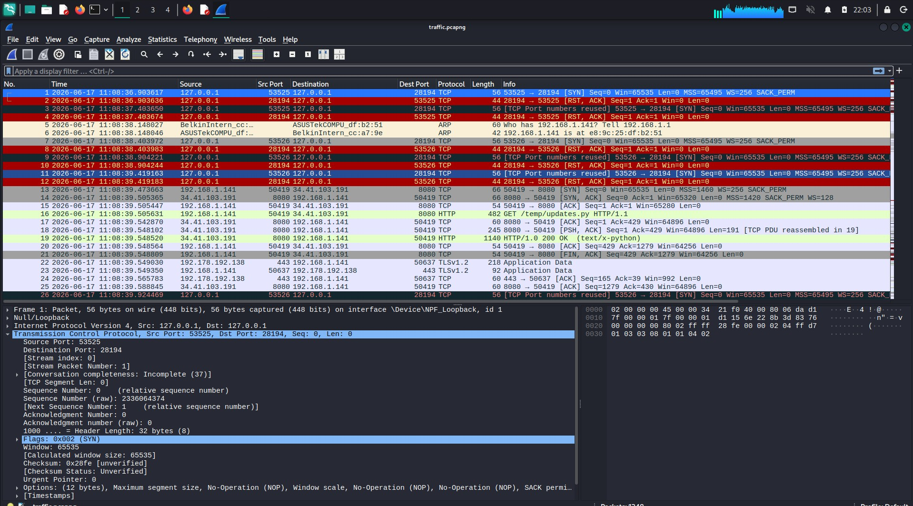
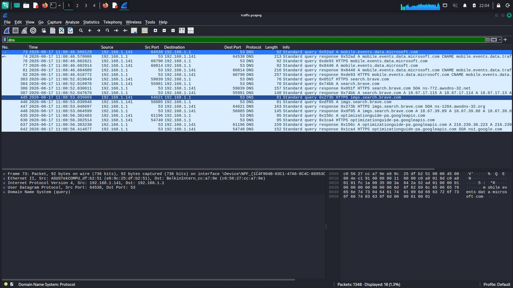
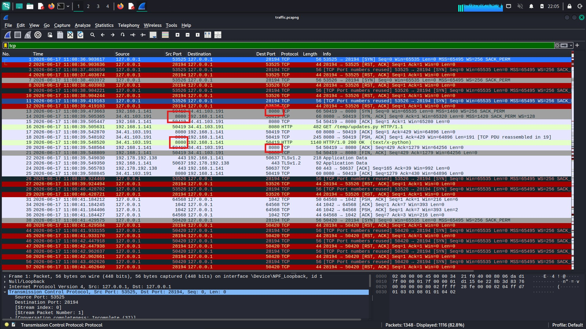
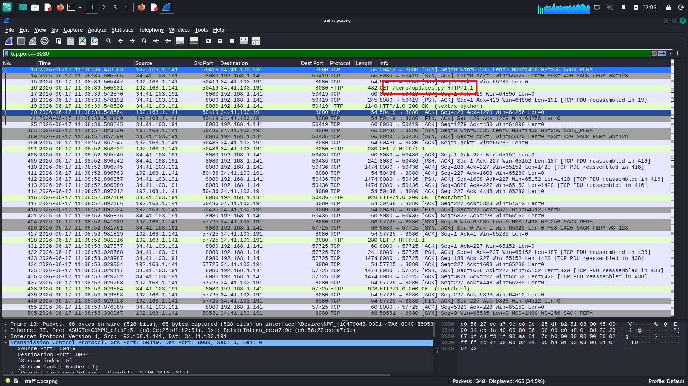
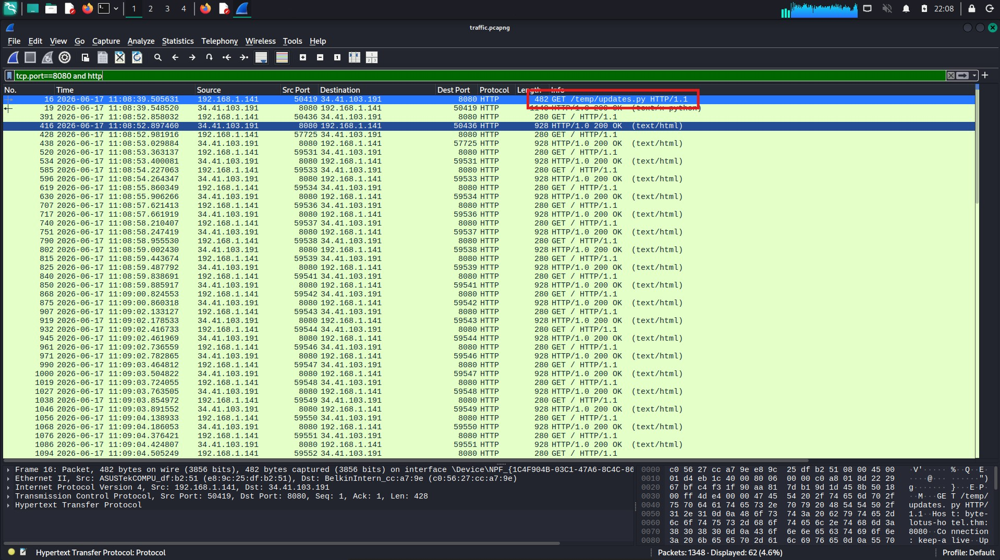
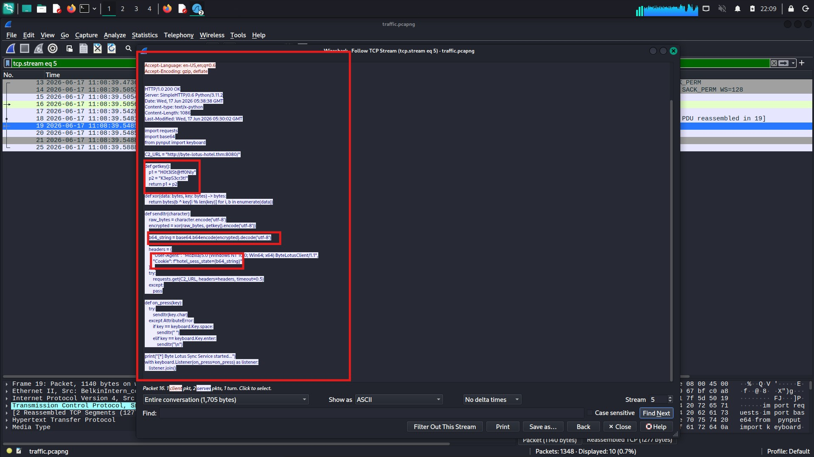
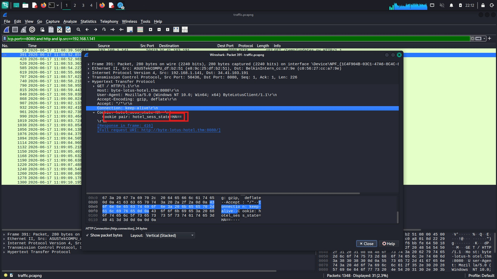
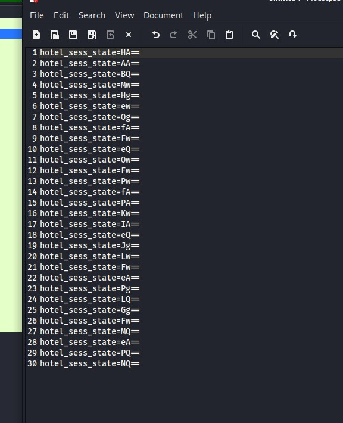
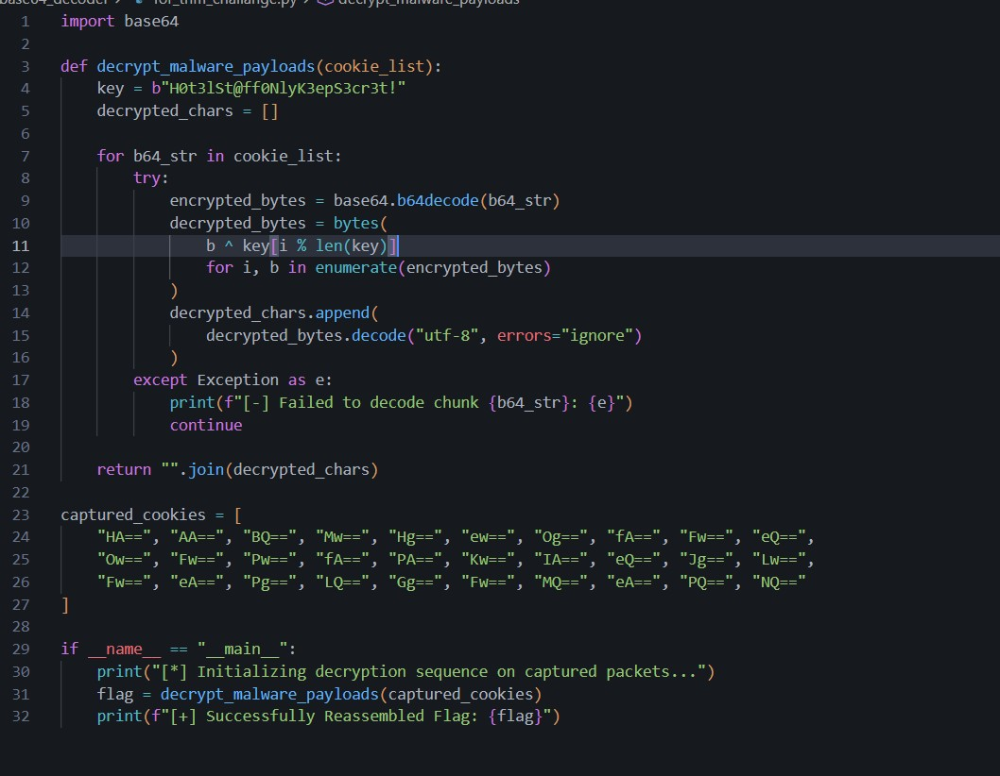
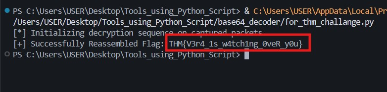

# TryHackMe — Byte Lotus
## Malware Traffic Analysis Report

---

# Report Information

| Field | Value |
|-------|-------|
| Challenge | Byte Lotus |
| Platform | TryHackMe |
| Category | Malware Traffic Analysis |
| Evidence | `target.pcap` |
| Analyst | Kuldeep Gade |
| Status | Completed |

---

# Executive Summary

During the investigation of the provided packet capture (`target.pcap`), suspicious outbound HTTP communication was discovered over TCP port **8080**. Further analysis revealed that the communication was not legitimate web traffic but rather malware retrieving a malicious Python script and later exfiltrating captured keystrokes back to its Command & Control (C2) server.

The malware disguised itself as a legitimate synchronization service named **Byte Lotus Sync Service** while secretly functioning as a Python keylogger. Stolen keystrokes were encrypted using a simple XOR routine, Base64 encoded, and transmitted inside HTTP Cookie headers.

Ultimately, the encrypted cookies were successfully decoded, revealing the challenge flag.

---

# Investigation Workflow

```
PCAP Analysis
      │
      ▼
DNS Inspection
      │
      ▼
Identify Suspicious Port
      │
      ▼
Inspect HTTP Requests
      │
      ▼
Retrieve Malware Script
      │
      ▼
Analyze Source Code
      │
      ▼
Extract Encoded Cookies
      │
      ▼
Decrypt XOR + Base64
      │
      ▼
Recover Flag
```

---

# Step 1 — DNS Traffic Analysis

The investigation started by examining all DNS packets to determine whether the infected machine contacted any suspicious domains.

### Wireshark Filter

```text
dns
```

### Observation

The capture contained DNS requests resolving the hostname:

```
byte-lotus-hotel.thm
```

Although malicious, the domain appeared legitimate by mimicking a hospitality service.

---

## Screenshot



---

# Step 2 — Port Enumeration

Instead of inspecting every packet individually, all communications using uncommon HTTP ports were isolated.

The investigation quickly highlighted repeated traffic over:

```
TCP Port 8080
```

### Wireshark Filter

```text
tcp.port == 8080
```

This significantly reduced the amount of traffic requiring inspection.

---

## Screenshot



---

# Step 3 — HTTP Traffic Inspection

Once suspicious traffic was isolated, only HTTP packets were displayed.

### Wireshark Filter

```text
tcp.port == 8080 and http
```

One request immediately stood out:

```
GET /temp/updates.py HTTP/1.1
```

The endpoint strongly suggested the download of a Python script.

---

## Screenshot



---

# Step 4 — TCP Stream Reconstruction

The HTTP request alone contained only part of the information.

To reconstruct the complete transmission:

```
Right Click
      ↓
Follow
      ↓
TCP Stream
```

Wireshark automatically reassembled the complete stream.

The response contained the entire Python malware source code.

---

## Screenshot



---

# Step 5 — Malware Analysis

The recovered Python script was analyzed statically.

The malware performed the following actions:

- Registered a keyboard hook using `pynput`
- Captured every keystroke
- XOR encrypted captured characters
- Encoded them using Base64
- Sent them inside HTTP Cookie headers
- Used a custom User-Agent
- Communicated with the C2 server

---

## Screenshot



---

# Malware Workflow

```
Keyboard Input
        │
        ▼
pynput Listener
        │
        ▼
XOR Encryption
        │
        ▼
Base64 Encoding
        │
        ▼
HTTP Cookie
        │
        ▼
GET Request
        │
        ▼
C2 Server
```

---

# Step 6 — Cookie Analysis

Inspection of subsequent HTTP requests revealed that the malware was sending encrypted data inside the Cookie header.

The suspicious cookie was:

```
hotel_sess_state
```

Each HTTP request transmitted only a single encrypted character.

---

## Screenshot



---

# Step 7 — Identifying the Encryption Weakness

The malware used the following logic:

```python
for i, c in enumerate(data):
```

However, because every request contained only **one character**, the loop always restarted from index **0**.

Consequently, every character was XORed only against:

```
'H'
```

instead of cycling through the full key.

This implementation flaw made the encryption trivial to reverse.

---

## Screenshot



---

# Step 8 — Extracting the Ciphertext

The Cookie values were collected chronologically.

```text
HA==
AA==
BQ==
Mw==
Hg==
ew==
Og==
fA==
Fw==
eQ==
Ow==
Fw==
Pw==
fA==
PA==
Kw==
IA==
eQ==
Jg==
Lw==
Fw==
eA==
Pg==
LQ==
Gg==
Fw==
MQ==
eA==
PQ==
NQ==
```

Each value represents one encrypted character.

---

## Screenshot



---

# Step 9 — Decryption

The following operations were performed:

1. Base64 Decode
2. XOR using ASCII value of 'H'

```
Cipher
      │
      ▼
Base64 Decode
      │
      ▼
XOR 0x48
      │
      ▼
Plaintext
```

The decrypted characters automatically reconstructed the original flag.

---

## Screenshot



---

# Final Result

## Flag

```text
THM{V3r4_1s_w4tch1ng_0veR_y0u}
```

---

## Screenshot



---

# Malware Indicators of Compromise (IoCs)

| Indicator | Value |
|------------|------|
| Domain | byte-lotus-hotel.thm |
| Protocol | HTTP |
| Port | 8080 |
| User-Agent | ByteLotusClient/1.1 |
| Cookie | hotel_sess_state |
| Malware | Python Keylogger |
| Encoding | Base64 |
| Encryption | XOR |

---

# MITRE ATT&CK Mapping

| Tactic | Technique |
|---------|-----------|
| Credential Access | Input Capture: Keylogging (T1056.001) |
| Collection | Data from Local System (T1005) |
| Command and Control | Application Layer Protocol (T1071.001) |
| Exfiltration | Exfiltration Over Web Service (T1567) |
| Defense Evasion | Masquerading (T1036) |

---

# Security Recommendations

### Network Security

- Restrict outbound HTTP communication over non-standard ports.
- Deploy IDS/IPS signatures for suspicious User-Agent strings.
- Monitor HTTP Cookie lengths and entropy.

---

### Endpoint Security

- Block unauthorized Python execution.
- Detect keyboard hook registration.
- Monitor persistence mechanisms.

---

### Threat Hunting

Search for:

- ByteLotusClient/*
- hotel_sess_state
- pynput
- updates.py
- byte-lotus-hotel.thm

---

# Conclusion

The investigation successfully reconstructed the malware communication chain from the packet capture.

Using Wireshark, the malicious Python payload was recovered, analyzed, and reverse engineered. The malware was identified as a Python-based keylogger that exfiltrated encrypted keystrokes through HTTP Cookie headers over TCP port 8080.

Due to an implementation flaw in the XOR encryption routine, the captured ciphertext was easily reversed, allowing complete recovery of the hidden flag.

The investigation demonstrates how packet analysis, protocol filtering, TCP stream reconstruction, and basic reverse engineering can expose malware behavior and recover exfiltrated data from seemingly ordinary network traffic.

---

# Tools Used

- Wireshark
- Python
- Base64
- XOR Decryption
- TCP Stream Reassembly
- Static Malware Analysis

---